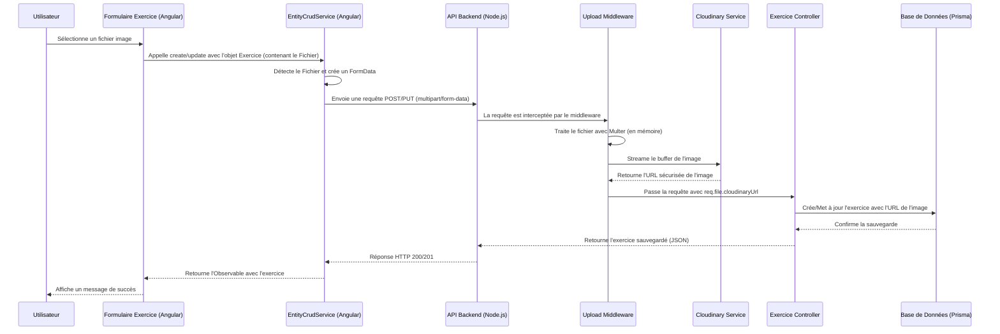

# Plan de Développement - Ultimate Frisbee Manager

Ce document suit les analyses et les actions menées sur le projet.

## Analyse Fonctionnelle : Gestion de l'Image d'un Exercice (Audit du 07/10/2025)

### Objectif

Analyser et documenter de bout en bout la fonctionnalité permettant d'associer une image à un exercice, sans y apporter de modification. L'analyse couvre le frontend (Angular), le backend (Node.js/Prisma) et la base de données.

### Fichiers Analysés

- **Backend**:
  - `backend/prisma/schema.prisma`
  - `backend/controllers/exercice.controller.js`
  - `backend/routes/exercice.routes.js`
  - `backend/middleware/upload.middleware.js`
- **Frontend**:
  - `frontend/src/app/features/exercices/services/exercice.service.ts`
  - `frontend/src/app/features/exercices/services/exercice-optimized.service.ts`
  - `frontend/src/app/shared/services/entity-crud.service.ts`
  - `frontend/src/app/features/exercices/components/exercice-card.component.html`
  - `frontend/src/app/features/exercices/components/exercice-card.component.ts`
  - `frontend/src/app/features/exercices/pages/exercice-form/exercice-form.component.ts`
  - `frontend/src/app/features/exercices/pages/exercice-form/exercice-form.component.html`

### Diagramme de Séquence du Flux d'Upload

### Synthèse du Fonctionnement

1.  **Base de Données** : Le modèle `Exercice` contient un champ optionnel `imageUrl` (`String?`) qui stocke l'URL de l'image.

2.  **Stockage** : Les fichiers images sont hébergés sur le service externe **Cloudinary**, dans le dossier `ultimate-frisbee-manager/exercices`.

3.  **Frontend (Upload)** :
    - Le `ExerciceFormComponent` utilise un composant `<app-image-upload>` pour la sélection de fichier.
    - Lors de la soumission, `EntityCrudService` détecte si un objet `File` est présent. Si oui, il construit un `FormData` pour envoyer une requête `multipart/form-data`.
    - L'utilisateur peut aussi coller une URL directement, auquel cas une requête JSON standard est envoyée.

4.  **Backend (Traitement)** :
    - Les routes `POST /api/exercices` et `PUT /api/exercices/:id` sont protégées par un middleware d'upload.
    - Ce middleware (`upload.middleware.js`) utilise `multer` pour gérer le fichier en mémoire, puis le streame vers Cloudinary.
    - Une fois l'upload réussi, l'URL retournée par Cloudinary est attachée à `req.file.cloudinaryUrl`.
    - Le `ExerciceController` récupère cette URL et la sauvegarde dans la base de données.

5.  **Affichage** :
    - Les composants (ex: `ExerciceCardComponent`) récupèrent l'entité `Exercice` avec son `imageUrl`.
    - Le template affiche l'image via ``, l'URL étant déjà absolue.

### Points d'Attention et Pistes d'Amélioration

-   **Images Orphelines** : La suppression d'un exercice ne supprime pas l'image correspondante sur Cloudinary. **Action possible** : Créer un endpoint sécurisé ou un script de nettoyage qui utilise l'`API Admin` de Cloudinary pour supprimer les images non référencées.
-   **Dépendance Externe** : La fonctionnalité dépend entièrement de Cloudinary. Toute interruption de ce service impactera l'upload et l'affichage des images.
-   **Sécurité** : Le `public_id` de l'image (son identifiant unique sur Cloudinary) est accessible via le middleware mais n'est pas stocké en base de données. Le stocker pourrait faciliter la gestion des suppressions à l'avenir.

## Standardisation de la Gestion des Images (07/10/2025)

### Objectif

Harmoniser la fonctionnalité de gestion des images pour les modules `Entrainement`, `Echauffement` et `SituationMatch` en se basant sur l'implémentation de référence du module `Exercice`.

### Actions Réalisées

Pour chaque module (`Entrainement`, `Echauffement`, `SituationMatch`), les corrections suivantes ont été appliquées pour assurer un fonctionnement cohérent et robuste :

#### Backend

1.  **Correction des Fichiers de Routes** (`entrainement.routes.js`, `echauffement.routes.js`, `situationmatch.routes.js`) :
    -   Le middleware d'upload `createUploader` a été corrigé pour écouter le nom de champ `image` au lieu de `schemaUrl`.
    -   Le dossier de destination sur Cloudinary a été standardisé (ex: `situations-matchs`).
    -   Le middleware `transformFormData` a été ajouté pour assurer le parsing correct des données de formulaire `multipart/form-data`.
    -   Les contrôleurs étaient déjà conformes et n'ont nécessité aucune modification.

#### Frontend

1.  **Correction des Services** (`entrainement.service.ts`, `echauffement.service.ts`, `situationmatch.service.ts`) :
    -   L'option `fileUploadField` dans la configuration du `EntityCrudService` a été corrigée pour utiliser `image` au lieu de `schemaUrl`.

2.  **Correction des Composants de Formulaire** (`entrainement-form.component.ts`, `echauffement-form.component.ts`, `situationmatch-form.component.ts`) :
    -   La logique de soumission (`onSubmit`) a été simplifiée pour s'appuyer sur le comportement natif du `EntityCrudService`, qui gère l'envoi `multipart/form-data` en une seule requête.
    -   La logique de sélection d'image (`onImageSelected`) a été standardisée pour utiliser `FileReader` afin de générer une prévisualisation locale.
    -   Les templates HTML ont été mis à jour pour utiliser le composant `<app-image-upload>` de manière cohérente, en le liant à la propriété `imagePreview` du composant.

### Résultat

L'ensemble de la fonctionnalité de gestion des images est maintenant standardisé sur tous les modules concernés. Le code est plus propre, plus robuste et plus facile à maintenir. Le comportement est désormais identique à celui du module `Exercice`.

## Correction des Erreurs de Compilation et Backend (08/10/2025)

### Problème

Après la standardisation, une série d'erreurs de compilation TypeScript empêchait le build du frontend. Une fois corrigées, une erreur 500 se produisait lors de la sauvegarde d'un échauffement avec une image.

### Analyse et Actions

1.  **Erreurs de Compilation Frontend :**
    *   **Cause 1 (`TS2322`) :** Incompatibilité de type sur `imagePreview` (`string | ArrayBuffer | null` au lieu de `string | null`).
    *   **Cause 2 (`TS2345`) :** Incompatibilité entre l'objet `EchauffementFormData` et le type `Partial<Echauffement>` attendu par le service, due à l'assignation de `null` à `imageUrl` et à la présence d'une propriété `image: File`.
    *   **Solution :**
        *   Correction du type de `imagePreview` en `string | null` et cast du résultat de `FileReader` en `string`.
        *   Remplacement de l'assignation `null` par `undefined` pour `imageUrl`.
        *   Cast de l'objet de données en `any` lors de l'appel au service pour permettre à l'upload de fonctionner sans erreur de type.

2.  **Erreur 500 Backend :**
    *   **Cause :** Le middleware `transform.middleware.js` ne parsait pas le champ `blocs` (envoyé comme une chaîne JSON dans les requêtes `multipart/form-data`), ce qui provoquait un crash dans le middleware de validation suivant.
    *   **Solution :** Mise à jour de `transform.middleware.js` pour qu'il parse correctement les champs JSON stringifiés comme `blocs` et `exercices`.

### Résultat

Le frontend compile sans erreur et la sauvegarde des entités avec des images est de nouveau fonctionnelle. Le middleware backend est maintenant plus robuste et capable de gérer des données complexes dans des formulaires `multipart/form-data`.

## Correction du Bug 500 sur la Mise à Jour avec Image (08/10/2025)

### Problème

Une erreur 500 persistante se produisait lors de la mise à jour d'un entraînement (ou échauffement) avec une image. Le log indiquait un crash dans le `validation.middleware.js`, ce qui a orienté le débogage vers de nombreuses fausses pistes (schémas Zod, middleware de transformation).

### Analyse et Résolution
### Résultat

- Le gestionnaire de tags ne crash plus même si certaines catégories sont vides.
- Les écrans consommateurs reçoivent des tableaux (éventuellement vides) pour toutes les catégories, améliorant la robustesse de l'UI.

### Suites possibles

- Ajouter des tests d'API garantissant que toutes les clés de `TAG_CATEGORIES` sont toujours présentes dans la réponse `/tags/grouped`.

## Plan horodaté — Refonte Export/Import & Nettoyage Trainings (feature/export-import-service)

- **Horodatage**: 2025-11-05T19:50:00+01:00
- **Branche de travail**: `feature/export-import-service`
- **Décision**: A) Supprimer définitivement `frontend/src/app/features/trainings` et consolider sur le module Entrainements existant (pas d’introduction de l’entité Phase pour cette itération)

### Objectif
Mettre en place un service d’export/import standardisé, documenté et testable pour les entités cibles (exercices, entrainements, échauffements, situations), tout en nettoyant l’ancien module `features/trainings` après sauvegarde/archivage (voir Prompt 0) et en respectant les contraintes de constantes centralisées et passage par managers/services.

### Périmètre
- Frontend Angular 17 (modules existants par feature)
- Backend Node.js (routes/controllers/services existants)
- Partage de constantes via `shared/constants` (équivalent monorepo des constantes globales; aucune valeur en dur)
- Documentation et scripts d’outillage (docs/, archive/)

### Étapes (0..N)
- **Étape 0 (fait via Prompt 0)**: Audit et sauvegarde initiale du module Trainings/Phase Optimized.
- **Étape 1 (présente)**: Préparation du plan et création branche PR `feature/export-import-service`.
- **Étape 2**: Spécification fonctionnelle Export/Import (formats JSON, structure, versioning, compatibilité ascendante).
- **Étape 3**: Implémentation Backend Export/Import
  - Services/contrôleurs dédiés export/import par ressource, réutilisant les managers existants.
  - Validation stricte (schémas) et logs d’audit.
- **Étape 4**: Implémentation Frontend Export/Import
  - Services centralisés (`core/services`) pour orchestrer export/import, UI minimale par feature.
  - Utilisation des constantes depuis `shared/constants` pour clés et defaults.
- **Étape 5**: Tests & vérifications
  - Tests d’API (export/import), scénarios volumétrie, erreurs de schéma.
  - Tests end-to-end ciblés pour flux utilisateur.
- **Étape 6**: Nettoyage contrôlé
  - Suppression du code `features/trainings` après confirmation d’archive et validation de non-régression.
- **Étape 7**: Documentation & PR
  - Mise à jour docs (guide d’utilisation export/import, risques, limites), ajout du bilan technique en PJ.

### Fichiers à créer/modifier (prévisionnel)
- **Backend**
  - `backend/controllers/export.controller.js` (nouveau)
  - `backend/controllers/import.controller.js` (nouveau)
  - `backend/routes/export.routes.js` (nouveau)
  - `backend/routes/import.routes.js` (nouveau)
  - Éventuelles mises à jour utilitaires (validation, transform) sans valeur en dur
- **Frontend**
  - `frontend/src/app/core/services/export-import.service.ts` (nouveau, façade unique)
  - Petites UIs par feature (boutons/export/import), réutilisant composants existants
  - Utilisation d’intercepteurs/guards existants, aucune duplication
- **Shared**
  - `shared/constants/export-import.ts` (nouveau): clés, versions de format, limites taille
- **Docs**
  - `docs/audit_phase_optimized.md` (existante depuis Étape 0)
  - `docs/bilan-phase-optimized.md` (existante depuis Étape 0)
  - `docs/export-import-spec.md` (nouveau)

### Checklist d’acceptation
- Export JSON par type d’entité conforme au schéma documenté (versionné)
- Import valide/robuste: validation schéma, erreurs explicites, idempotence sur items existants
- Aucune valeur en dur, toutes constantes via `shared/constants`
- Respect des services/managers existants (pas d’accès direct non médié)
- Logs d’audit côté backend pour opérations d’import
- Tests automatisés: unitaires backend, e2e minimal pour flux export/import
- Documentation utilisateur et technique à jour

### Plan de rollback
- Revert Git de la branche `feature/export-import-service` (commit de rollback)
- Restauration du module `features/trainings` depuis `archive/old_trainings_module/<timestamp>` si nécessaire
- Désactivation temporaire des routes/export-import via feature flag (constante partagée) si problème en prod
