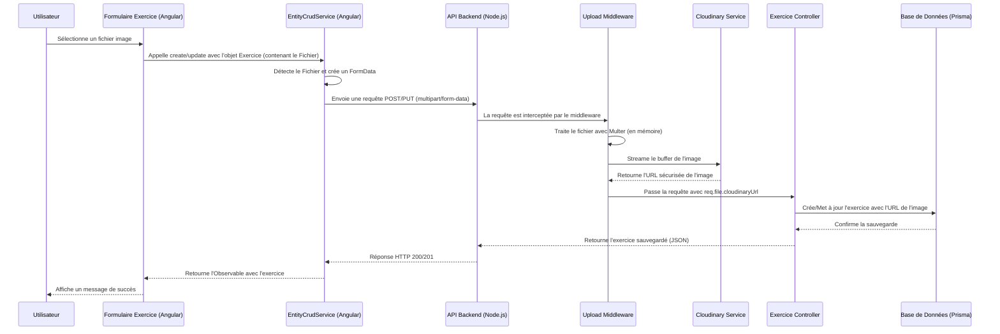

## Mission : Export UFM — Livraison finale

- ✅ Seed minimal validé et intégré
- ✅ Export JSON validé
- ✅ Vérification sécurité & Cloudinary
- ✅ Documentation complète
- ✅ Tests Prisma et routes API OK
- ✅ Branche master prête au déploiement

# Plan de Développement - Ultimate Frisbee Manager

Ce document suit les analyses et les actions menées sur le projet.

## Sommaire
- [Missions récentes (consolidé)](#missions-récentes-consolidé)
- [Organisation par domaines](#organisation-par-domaines)
- [Analyse Fonctionnelle : Gestion de l'Image d'un Exercice (Audit du 07/10/2025)](#analyse-fonctionnelle--gestion-de-limage-dun-exercice-audit-du-07102025)
- [Standardisation de la Gestion des Images (07/10/2025)](#standardisation-de-la-gestion-des-images-07102025)
- [Correction des Erreurs de Compilation et Backend (08/10/2025)](#correction-des-erreurs-de-compilation-et-backend-08102025)
- [Correction du Bug 500 sur la Mise à Jour avec Image (08/10/2025)](#correction-du-bug-500-sur-la-mise-à-jour-avec-image-08102025)
- [Plan horodaté — Refonte Export/Import & Nettoyage Trainings (feature/export-import-service)](#plan-horodaté--refonte-exportimport--nettoyage-trainings-featureexport-import-service)
- [Documentation — Module Cloudinary (08/11/2025)](#documentation--module-cloudinary-08112025)
- [Mission ENV — Cloudinary et variables globales (08/11/2025)](#mission-env--cloudinary-et-variables-globales-08112025)
- [Mission Import/Export — Généralisation (08/11/2025)](#mission-importexport--généralisation-08112025)
- [Mission API Cleanup — Uniformisation des routes (08/11/2025)](#mission-api-cleanup--uniformisation-des-routes-08112025)
- [État du projet](#état-du-projet)
- [Prochaines étapes](#prochaines-étapes)
- [Bilan complet Backend + Script Export (11/11/2025)](#bilan-complet-backend--script-export-11112025)
- [Documentation des routes API](docs/API_ROUTES.md)

## Missions récentes (consolidé)

- **ENV / Cloudinary**
  - Objectif: Standardiser les variables (priorité `CLOUDINARY_URL`) et valider au démarrage.
  - Fichiers: `backend/.env`, `backend/.env.example`, `backend/config/index.js`, `backend/services/cloudinary.js`, `backend/server.js`, `render.yaml`, `README.md`.
  - Résultat: Config unifiée, avertissements clairs, secrets Render ajoutés. `JWT_REFRESH_SECRET` rendu optionnel (warning au démarrage si absent). Cloudinary: fallback URL → triplet documenté + log du mode utilisé.
  - Tests: Démarrage → logs (inclut ping Cloudinary et info de mode), upload image → OK.
  - Points manuels: Créer secrets Render `jwt-secret`, `jwt-refresh-secret`, `cloudinary-url`; vérifier `CORS_ORIGINS`.

- **Module Cloudinary**
  - Objectif: Centraliser upload/suppression/URL et ajouter un ping de connexion.
  - Fichiers: `backend/services/cloudinary.js`, `backend/services/upload.service.js`, `backend/middleware/upload.middleware.js`.
  - Résultat: Upload via service, erreurs catchées, `testCloudinaryConnection()` au démarrage.
  - Tests: Upload exercice/profil; ping Cloudinary en log.
  - Points manuels: Aucun.

- **Import/Export Generalization**
  - Objectif: Unifier import/export sur 4 catégories, façade générique côté front.
  - Fichiers: `backend/controllers/import.controller.js`, `backend/services/export.service.js`, `backend/controllers/export.controller.js`, `backend/routes/import.routes.js`, `backend/routes/admin.routes.js`, `frontend/src/app/core/services/{import.service.ts,data-transfer.service.ts}`, `features/settings/pages/import-export/...`.
  - Résultat: Payload multi-types orchestré côté front; export générique backend; tests couvrent 4 catégories.
  - Tests: `backend/tests/import_export.test.js` (dryRun/apply/export) + UI Import/Export.
  - Points manuels: Option V2 `/api/import/payload` si besoin d’un call unique.

- **API Cleanup**
  - Objectif: Uniformiser et documenter les routes, ajouter alias EN sans casser l’existant.
  - Fichiers: `backend/routes/index.js`, `docs/API_ROUTES.md`.
  - Résultat: Alias `/api/exercises|trainings|warmups|matches` ajoutés; page `/api` documente FR+EN.
  - Tests: GET listes FR et EN → mêmes réponses; UI continue de fonctionner.
  - Points manuels: Migration progressive du front possible via `ApiUrlService`.
  - Documentation détaillée des endpoints clés: voir `docs/API_ROUTES.md`.

- **Admin list-<type> (11/11/2025)**
  - Objectif: Exposer les listes pour le script `backend/scripts/export-ufm.js` via `/api/admin/list-{exercices|entrainements|echauffements|situations-matchs}`.
  - Fichiers: `backend/controllers/admin.controller.js` (handlers `listExercices|listEntrainements|listEchauffements|listSituationsMatchs`), `backend/routes/admin.routes.js` (déclarations, protégées JWT+admin), `backend/__tests__/admin-list.test.js` (Supertest).
  - Format de réponse: tableau JSON d’objets `{ id, titre }` trié par `createdAt desc`.
  - Vérification: `curl -H "Authorization: Bearer <TOKEN>" http://localhost:3002/api/admin/list-exercices` renvoie `200` et une liste; tests automatisés passent.

- **Auth login (11/11/2025)**
  - Objectif: Permettre l’authentification email/password pour scripts externes (ex: `scripts/export-ufm.js`).
  - Fichiers: `backend/controllers/auth.controller.js` (handler `login`), `backend/routes/auth.routes.js` (POST `/api/auth/login` + rate limit).
  - Entrée: `POST /api/auth/login` Body JSON `{ email, password }`.
  - Sortie: `{ accessToken, refreshToken, user }` (où `user` contient `id,email,nom,prenom,role,isActive,iconUrl`).
  - Sécurité: Rate limit 5 req/15 min/IP; validations de champs; messages d’erreur explicites (`INVALID_CREDENTIALS`, `INACTIVE_ACCOUNT`, `RATE_LIMIT`).

## Organisation par domaines

- **Configuration**
  - ENV/Secrets: `backend/.env`, `backend/.env.example`, `render.yaml`.
  - Config runtime/validation: `backend/config/index.js`, `backend/server.js`.
- **Services**
  - Cloudinary: `backend/services/cloudinary.js`, `backend/services/upload.service.js`.
  - Export: `backend/services/export.service.js`.
- **API**
  - Routes FR + alias EN: `backend/routes/index.js`, `docs/API_ROUTES.md`.
  - Import: `backend/routes/import.routes.js`, `backend/controllers/import.controller.js`.
  - Export: `backend/controllers/export.controller.js`.
  - Ressources: exercices/entrainements/echauffements/situations (routes + contrôleurs).
- **UI**
  - Import/Export: `frontend/src/app/core/services/data-transfer.service.ts`, `frontend/src/app/core/services/import.service.ts`, `features/settings/pages/import-export/...`.
- **Données**
  - Prisma: `backend/services/prisma.js`, `backend/prisma/*`.

## Analyse Fonctionnelle : Gestion de l'Image d'un Exercice (Audit du 07/10/2025)

### Objectif

Analyser et documenter de bout en bout la fonctionnalité permettant d'associer une image à un exercice, sans y apporter de modification. L'analyse couvre le frontend (Angular), le backend (Node.js/Prisma) et la base de données.

### Fichiers Analysés

- **Backend**:
  - `backend/prisma/schema.prisma`
  - `backend/controllers/exercice.controller.js`
  - `backend/routes/exercice.routes.js`
  - `backend/middleware/upload.middleware.js`
- **Frontend**:
  - `frontend/src/app/features/exercices/services/exercice.service.ts`
  - `frontend/src/app/features/exercices/services/exercice-optimized.service.ts`
  - `frontend/src/app/shared/services/entity-crud.service.ts`
  - `frontend/src/app/features/exercices/components/exercice-card.component.html`
  - `frontend/src/app/features/exercices/components/exercice-card.component.ts`
  - `frontend/src/app/features/exercices/pages/exercice-form/exercice-form.component.ts`
  - `frontend/src/app/features/exercices/pages/exercice-form/exercice-form.component.html`

### Diagramme de Séquence du Flux d'Upload



### Synthèse du Fonctionnement

1.  **Base de Données** : Le modèle `Exercice` contient un champ optionnel `imageUrl` (`String?`) qui stocke l'URL de l'image.

2.  **Stockage** : Les fichiers images sont hébergés sur le service externe **Cloudinary**, dans le dossier `ultimate-frisbee-manager/exercices`.

3.  **Frontend (Upload)** :
    - Le `ExerciceFormComponent` utilise un composant `<app-image-upload>` pour la sélection de fichier.
    - Lors de la soumission, `EntityCrudService` détecte si un objet `File` est présent. Si oui, il construit un `FormData` pour envoyer une requête `multipart/form-data`.
    - L'utilisateur peut aussi coller une URL directement, auquel cas une requête JSON standard est envoyée.

4.  **Backend (Traitement)** :
    - Les routes `POST /api/exercices` et `PUT /api/exercices/:id` sont protégées par un middleware d'upload.
    - Ce middleware (`upload.middleware.js`) utilise `multer` pour gérer le fichier en mémoire, puis le streame vers Cloudinary.
    - Une fois l'upload réussi, l'URL retournée par Cloudinary est attachée à `req.file.cloudinaryUrl`.
    - Le `ExerciceController` récupère cette URL et la sauvegarde dans la base de données.

5.  **Affichage** :
    - Les composants (ex: `ExerciceCardComponent`) récupèrent l'entité `Exercice` avec son `imageUrl`.
    - Le template affiche l'image via ``, l'URL étant déjà absolue.

### Points d'Attention et Pistes d'Amélioration

-   **Images Orphelines** : La suppression d'un exercice ne supprime pas l'image correspondante sur Cloudinary. **Action possible** : Créer un endpoint sécurisé ou un script de nettoyage qui utilise l'`API Admin` de Cloudinary pour supprimer les images non référencées.
-   **Dépendance Externe** : La fonctionnalité dépend entièrement de Cloudinary. Toute interruption de ce service impactera l'upload et l'affichage des images.
-   **Sécurité** : Le `public_id` de l'image (son identifiant unique sur Cloudinary) est accessible via le middleware mais n'est pas stocké en base de données. Le stocker pourrait faciliter la gestion des suppressions à l'avenir.

## Standardisation de la Gestion des Images (07/10/2025)

### Objectif

Harmoniser la fonctionnalité de gestion des images pour les modules `Entrainement`, `Echauffement` et `SituationMatch` en se basant sur l'implémentation de référence du module `Exercice`.

### Actions Réalisées

Pour chaque module (`Entrainement`, `Echauffement`, `SituationMatch`), les corrections suivantes ont été appliquées pour assurer un fonctionnement cohérent et robuste :

#### Backend

1.  **Correction des Fichiers de Routes** (`entrainement.routes.js`, `echauffement.routes.js`, `situationmatch.routes.js`) :
    -   Le middleware d'upload `createUploader` a été corrigé pour écouter le nom de champ `image` au lieu de `schemaUrl`.
    -   Le dossier de destination sur Cloudinary a été standardisé (ex: `situations-matchs`).
    -   Le middleware `transformFormData` a été ajouté pour assurer le parsing correct des données de formulaire `multipart/form-data`.
    -   Les contrôleurs étaient déjà conformes et n'ont nécessité aucune modification.

#### Frontend

1.  **Correction des Services** (`entrainement.service.ts`, `echauffement.service.ts`, `situationmatch.service.ts`) :
    -   L'option `fileUploadField` dans la configuration du `EntityCrudService` a été corrigée pour utiliser `image` au lieu de `schemaUrl`.

2.  **Correction des Composants de Formulaire** (`entrainement-form.component.ts`, `echauffement-form.component.ts`, `situationmatch-form.component.ts`) :
    -   La logique de soumission (`onSubmit`) a été simplifiée pour s'appuyer sur le comportement natif du `EntityCrudService`, qui gère l'envoi `multipart/form-data` en une seule requête.
    -   La logique de sélection d'image (`onImageSelected`) a été standardisée pour utiliser `FileReader` afin de générer une prévisualisation locale.
    -   Les templates HTML ont été mis à jour pour utiliser le composant `<app-image-upload>` de manière cohérente, en le liant à la propriété `imagePreview` du composant.

### Résultat

L'ensemble de la fonctionnalité de gestion des images est maintenant standardisé sur tous les modules concernés. Le code est plus propre, plus robuste et plus facile à maintenir. Le comportement est désormais identique à celui du module `Exercice`.

## Correction des Erreurs de Compilation et Backend (08/10/2025)

### Problème

Après la standardisation, une série d'erreurs de compilation TypeScript empêchait le build du frontend. Une fois corrigées, une erreur 500 se produisait lors de la sauvegarde d'un échauffement avec une image.

### Analyse et Actions

1.  **Erreurs de Compilation Frontend :**
    *   **Cause 1 (`TS2322`) :** Incompatibilité de type sur `imagePreview` (`string | ArrayBuffer | null` au lieu de `string | null`).
    *   **Cause 2 (`TS2345`) :** Incompatibilité entre l'objet `EchauffementFormData` et le type `Partial<Echauffement>` attendu par le service, due à l'assignation de `null` à `imageUrl` et à la présence d'une propriété `image: File`.
    *   **Solution :**
        *   Correction du type de `imagePreview` en `string | null` et cast du résultat de `FileReader` en `string`.
        *   Remplacement de l'assignation `null` par `undefined` pour `imageUrl`.
        *   Cast de l'objet de données en `any` lors de l'appel au service pour permettre à l'upload de fonctionner sans erreur de type.

2.  **Erreur 500 Backend :**
    *   **Cause :** Le middleware `transform.middleware.js` ne parsait pas le champ `blocs` (envoyé comme une chaîne JSON dans les requêtes `multipart/form-data`), ce qui provoquait un crash dans le middleware de validation suivant.
    *   **Solution :** Mise à jour de `transform.middleware.js` pour qu'il parse correctement les champs JSON stringifiés comme `blocs` et `exercices`.

### Résultat

Le frontend compile sans erreur et la sauvegarde des entités avec des images est de nouveau fonctionnelle. Le middleware backend est maintenant plus robuste et capable de gérer des données complexes dans des formulaires `multipart/form-data`.

## Correction du Bug 500 sur la Mise à Jour avec Image (08/10/2025)

### Problème

Une erreur 500 persistante se produisait lors de la mise à jour d'un entraînement (ou échauffement) avec une image. Le log indiquait un crash dans le `validation.middleware.js`, ce qui a orienté le débogage vers de nombreuses fausses pistes (schémas Zod, middleware de transformation).

### Analyse et Résolution
### Résultat

- Le gestionnaire de tags ne crash plus même si certaines catégories sont vides.
- Les écrans consommateurs reçoivent des tableaux (éventuellement vides) pour toutes les catégories, améliorant la robustesse de l'UI.

### Suites possibles

- Ajouter des tests d'API garantissant que toutes les clés de `TAG_CATEGORIES` sont toujours présentes dans la réponse `/tags/grouped`.

## Plan horodaté — Refonte Export/Import & Nettoyage Trainings (feature/export-import-service)

- **Horodatage**: 2025-11-05T19:50:00+01:00
- **Branche de travail**: `feature/export-import-service`
- **Décision**: A) Supprimer définitivement `frontend/src/app/features/trainings` et consolider sur le module Entrainements existant (pas d’introduction de l’entité Phase pour cette itération)

### Objectif
Mettre en place un service d’export/import standardisé, documenté et testable pour les entités cibles (exercices, entrainements, échauffements, situations), tout en nettoyant l’ancien module `features/trainings` après sauvegarde/archivage (voir Prompt 0) et en respectant les contraintes de constantes centralisées et passage par managers/services.

### Périmètre
- Frontend Angular 17 (modules existants par feature)
- Backend Node.js (routes/controllers/services existants)
- Partage de constantes via `shared/constants` (équivalent monorepo des constantes globales; aucune valeur en dur)
- Documentation et scripts d’outillage (docs/, archive/)

### Étapes (0..N)
- **Étape 0 (fait via Prompt 0)**: Audit et sauvegarde initiale du module Trainings/Phase Optimized.
- **Étape 1 (présente)**: Préparation du plan et création branche PR `feature/export-import-service`.
- **Étape 2**: Spécification fonctionnelle Export/Import (formats JSON, structure, versioning, compatibilité ascendante).
- **Étape 3**: Implémentation Backend Export/Import
  - Services/contrôleurs dédiés export/import par ressource, réutilisant les managers existants.
  - Validation stricte (schémas) et logs d’audit.
- **Étape 4**: Implémentation Frontend Export/Import
  - Services centralisés (`core/services`) pour orchestrer export/import, UI minimale par feature.
  - Utilisation des constantes depuis `shared/constants` pour clés et defaults.
- **Étape 5**: Tests & vérifications
  - Tests d’API (export/import), scénarios volumétrie, erreurs de schéma.
  - Tests end-to-end ciblés pour flux utilisateur.
- **Étape 6**: Nettoyage contrôlé
  - Suppression du code `features/trainings` après confirmation d’archive et validation de non-régression.
- **Étape 7**: Documentation & PR
  - Mise à jour docs (guide d’utilisation export/import, risques, limites), ajout du bilan technique en PJ.

### Fichiers à créer/modifier (prévisionnel)
- **Backend**
  - `backend/controllers/export.controller.js` (nouveau)
  - `backend/controllers/import.controller.js` (nouveau)
  - `backend/routes/export.routes.js` (nouveau)
  - `backend/routes/import.routes.js` (nouveau)
  - Éventuelles mises à jour utilitaires (validation, transform) sans valeur en dur
- **Frontend**
  - `frontend/src/app/core/services/export-import.service.ts` (nouveau, façade unique)
  - Petites UIs par feature (boutons/export/import), réutilisant composants existants
  - Utilisation d’intercepteurs/guards existants, aucune duplication
- **Shared**
  - `shared/constants/export-import.ts` (nouveau): clés, versions de format, limites taille
- **Docs**
  - `docs/audit_phase_optimized.md` (existante depuis Étape 0)
  - `docs/bilan-phase-optimized.md` (existante depuis Étape 0)
  - `docs/export-import-spec.md` (nouveau)

### Checklist d’acceptation
- Export JSON par type d’entité conforme au schéma documenté (versionné)
- Import valide/robuste: validation schéma, erreurs explicites, idempotence sur items existants
- Aucune valeur en dur, toutes constantes via `shared/constants`
- Respect des services/managers existants (pas d’accès direct non médié)
- Logs d’audit côté backend pour opérations d’import
- Tests automatisés: unitaires backend, e2e minimal pour flux export/import
- Documentation utilisateur et technique à jour

### Plan de rollback
- Revert Git de la branche `feature/export-import-service` (commit de rollback)
- Restauration du module `features/trainings` depuis `archive/old_trainings_module/<timestamp>` si nécessaire
- Désactivation temporaire des routes/export-import via feature flag (constante partagée) si problème en prod

## Refonte Import/Export – Implémentation UI/UX + Connexion (07/11/2025)

### Objectif
Créer un onglet unique "Import/Export" cohérent avec le thème, connecté au nouveau service backend d'import, et supprimer l'ancien système frontend (service local, écran debug, resolver tags).

### Actions réalisées
- Suppression/archivage de l'ancien système (frontend):
  - core/services/export-import.service.ts → documentation/archive/removed/
  - core/components/import-resolver/import-resolver.component.ts → documentation/archive/removed/
  - features/debug/export-import-debug.component.ts → documentation/archive/removed/
  - core/utils/import-validator.ts → documentation/archive/removed/
  - shared/constants/export-import.ts → documentation/archive/removed/
- Nettoyage des routes/menus:
  - app.module.ts: suppression de la route debug/export-import
  - app.component.html: menu Paramètres → lien vers /parametres/import-export
  - settings.module.ts: ajout de la route /parametres/import-export (standalone)
- Nouveau service central:
  - core/services/data-transfer.service.ts (pont vers ImportService; placeholders export)
- Nouvel écran:
  - features/settings/pages/import-export/import-export.component.ts
  - features/settings/pages/import-export/missing-fields-dialog.component.ts (dialogue tolérant champs manquants)

### Connexions backend
- Import Markdown/JSON via endpoints existants:
  - POST /api/import/markdown?dryRun=true|false
  - POST /api/import/exercices?dryRun=true|false
- Export: en attente d'un endpoint backend (placeholders côté UI/service).

### Tests rapides (manuels)
- Navigation: Paramètres → Import/Export.
- Import Markdown: sélectionner .md, Dry-run puis Appliquer → rapport visible, création/maj OK.
- Import JSON: coller { exercices: [...] }, tester cas champs manquants → ouverture du dialogue, appliquer/ignorer puis exécuter.
- Snackbars: messages succès/erreur visibles.

### Points d'attention / suites
- Créer endpoint(s) d'export backend et brancher DataTransferService.export*.
- Journal des transferts: V1 local, V2 backend.

## Documentation de la Refonte Import/Export

## Documentation — Module Cloudinary (08/11/2025)

### Services et fonctions
- `services/cloudinary.js`
  - `cloudinary`: instance configurée (v2). Priorité à `CLOUDINARY_URL`, fallback triplet. `secure: true`.
  - `testCloudinaryConnection(): Promise<{ ok: boolean, details?: any, error?: any }>`
    - Appelle `cloudinary.api.ping()`.
    - Retourne `{ ok: true }` si la config est valide; sinon `{ ok: false, error }`.
- `services/upload.service.js`
  - `uploadBuffer(buffer: Buffer, folder: string, options?): Promise<{ secure_url: string, public_id: string }>`
  - `deleteByPublicId(publicId: string): Promise<any>`
  - `getUrl(publicId: string, options?): string`
- `middleware/upload.middleware.js`
  - `createUploader(fieldName: string, subfolder: string)`
    - Utilise Multer mémoire + `uploadBuffer`.
    - Enrichit `req.file.cloudinaryUrl` et `req.file.cloudinaryPublicId`.

### Inputs/Outputs
- Input upload: fichier image (`.png`, `.jpg`, `.jpeg`, `.gif`, `.webp`) via `multipart/form-data` champ `image`.
- Output upload: `req.file` enrichi avec `cloudinaryUrl` (string) et `cloudinaryPublicId` (string).

### Gestion d’erreurs
- Upload: erreurs Cloudinary catched → `next(new Error('Erreur lors de l'upload sur Cloudinary.'))` → standardisé par `errorHandler.middleware` côté API.
- Startup: logs d’avertissement si `CLOUDINARY_URL` absente; `api.ping` logge succès/échec.

### Tests à réaliser
- Upload Exercice (POST /api/exercices):
  - Cas OK: image valide → `imageUrl` persistée en base (vérifier via GET).
  - Cas KO: extension non autorisée → erreur 400 depuis middleware Multer.
  - Cas KO: Cloudinary mal configuré → 500 avec message générique et log serveur détaillé.
- Avatar utilisateur (PUT /api/auth/profile avec `image`):
  - `req.file.cloudinaryUrl` utilisé pour `iconUrl`.
- `testCloudinaryConnection()` au démarrage: vérifier log ✅/⚠️.

### Notes
- Aucune clé ou URL Cloudinary en dur dans le code source.
- Config unifiée via `.env`/Render secrets.

## Mission ENV — Cloudinary et variables globales (08/11/2025)

## Mission Import/Export — Généralisation (08/11/2025)

## Mission API Cleanup — Uniformisation des routes (08/11/2025)

### Reformulation
Uniformiser et documenter les routes API. Conserver les routes FR historiques et ajouter des alias REST en EN (`/api/exercises`, `/api/trainings`, `/api/warmups`, `/api/matches`).

### Fichiers impactés
- `backend/routes/index.js` (ajout des alias EN + listing dans `/api`)
- `docs/API_ROUTES.md` (nouveau, catalogue des routes+méthodes)

### Audit (résumé)
- Routes FR: `/api/exercices`, `/api/entrainements`, `/api/echauffements`, `/api/situations-matchs`, `/api/tags`, `/api/dashboard`, `/api/import`, `/api/admin`, `/api/health`, `/api/auth`.
- Alias EN ajoutés: `/api/exercises`, `/api/trainings`, `/api/warmups`, `/api/matches` → mappés sur les mêmes routeurs.
- Frontend: `ApiUrlService` utilise des endpoints FR; compat maintenue. Migration possible vers EN sans breaking change.

### Validation
- Vérifier que les appels existants (FR) continuent de répondre 200.
- Vérifier qu’un appel sur alias EN renvoie la même réponse (ex: GET `/api/exercises`).

### Suites
- Option: migrer progressivement le frontend vers les alias EN via `ApiUrlService`.
- Maintenir `docs/API_ROUTES.md` à jour à chaque ajout/modif de route.

### Reformulation
Unifier l’import/export sur 4 catégories (exercice, entrainement, echauffement, situation) via un service réutilisable sans duplication, avec tests et documentation.

### Contexte
- Backend dispose déjà des routes par catégorie: `/api/import/{exercices|entrainements|echauffements|situations-matchs}` et d’un export générique `GET /api/admin/export-ufm`.
- Frontend dispose d’un service centralisé: `core/services/data-transfer.service.ts` capable d’orchestrer payload multi-types et d’appeler chaque endpoint.
- Tests backend présents: `backend/tests/import_export.test.js` couvrant les 4 catégories (dryRun/apply/export).

### Fichiers impliqués (audit)
- Backend
  - `backend/controllers/import.controller.js` (handlers d’import par type + Markdown→Exercices)
  - `backend/services/export.service.js` (export générique par type)
  - `backend/controllers/export.controller.js` (contrôleur d’export)
  - `backend/routes/import.routes.js`, `backend/routes/admin.routes.js`, `backend/routes/index.js`
  - `backend/tests/import_export.test.js`
- Frontend
  - `frontend/src/app/core/services/import.service.ts` (endpoints import)
  - `frontend/src/app/core/services/data-transfer.service.ts` (façade générique import/export)
  - `frontend/src/app/features/settings/pages/import-export/import-export.component.ts` (UI)

### Solutions
- Conserver l’API par catégorie (stabilité, granularité) et exposer un flux multi-types côté front via `DataTransferService.importPayload()` déjà implémenté.
- Option (V2): ajouter `POST /api/import/payload` qui accepterait un payload mixte et dispatcherait côté backend (façade), sans réécrire la logique métier par type.

### Validation
- Import/Export validés par les tests existants (voir `backend/tests/import_export.test.js`).
- Encodage UTF-8: lecture fichiers front via `FileReader.readAsText(..., 'utf-8')`.
- Idempotence: dryRun détecte create/update/skip, apply applique avec upsert/replace contrôlés.

### Format JSON attendu (par type, extrait)
- Exercices: `{ exercices: [{ nom, description, imageUrl?, schemaUrl?, variablesPlus?, variablesMinus?, tags?: [{label, category, level?}] }] }`
- Entrainements: `{ entrainements: [{ titre, date?, imageUrl?, echauffementId?, situationMatchId?, tags?[], exercices?: [{ exerciceId, ordre?, duree?, notes? }] }] }`
- Échauffements: `{ echauffements: [{ nom, description?, imageUrl?, blocs?: [{ ordre?, titre, repetitions?, temps?, informations?, fonctionnement?, notes? }] }] }`
- Situations: `{ situations: [{ type, nom?, description?, temps?, imageUrl?, tags?: [{label, category, level?}] }] }`

### Améliorations futures
- Endpoint unique backend `/api/import/payload` (façade), journal des transferts, exportMultiple côté front.

### Statut
- Unification effective via service frontend générique + endpoints backend par catégorie + export générique.
- Documentation mise à jour; tests existants couvrent les 4 catégories.

### Reformulation
Uniformiser la gestion des variables d’environnement (dev/prod), corriger Cloudinary (préférence `CLOUDINARY_URL`), ajouter validations au démarrage et documenter.

### Contexte
- Backend Express avec upload Cloudinary via middleware mémoire + stream.
- Déploiement Render (PostgreSQL) et Frontend Vercel.
- Variables existantes mais incomplètes/incohérentes (manque JWT_REFRESH_SECRET en prod, pas d’URL Cloudinary unique, warning non explicite).

### Fichiers impactés
- `backend/.env` (ajout `CLOUDINARY_URL`, section Cloudinary)
- `backend/.env.example` (complétée: DB, CORS, JWT, Cloudinary)
- `backend/config/index.js` (chemin `.env`, validation Cloudinary, warning si pas d’URL)
- `backend/services/cloudinary.js` (support URL directe + fallback clés séparées)
- `backend/server.js` (warning explicite au démarrage si `CLOUDINARY_URL` absente)
- `render.yaml` (ajout `JWT_REFRESH_SECRET`, `CLOUDINARY_URL` via secrets)
- `README.md` (section Configuration enrichie)

### Hypothèses
- En prod Render: secrets gérés via Render Secrets; l’URL Cloudinary est préférée.
- En dev: SQLite et URL Cloudinary de test.

### Solutions retenues
- Standardisation sur `CLOUDINARY_URL` (format `cloudinary://<api_key>:<api_secret>@dmiqnc2o6`) avec fallback `CLOUDINARY_*`.
- Validation/avertissements centralisés dans `config/index.js` + log au démarrage.
- Exemple d’environnement exhaustif dans `.env.example`.
- Déclaration des secrets manquants dans `render.yaml`.

### Implémentation
- Voir commits sur les fichiers listés (sections ci-dessus).

### Vérification
- Démarrage local: logs affichent l’avertissement si `CLOUDINARY_URL` manquante et connexion DB OK.
- Import d’image: middleware utilise bien `cloudinary.uploader.upload_stream` (pas d’erreur SDK).
- Recherche code: aucune clé Cloudinary en dur hors `.env`.

### Instructions post-déploiement (Render)
- Créer/mettre à jour Secrets: `jwt-secret`, `jwt-refresh-secret`, `cloudinary-url`.
- Vérifier CORS_ORIGINS selon le domaine Vercel effectif.
- Déclencher un redeploy.

### Objectif
Documenter la refonte de l'import/export, en mettant en avant les changements apportés, les avantages et les points d'attention.

### Changements apportés

*   Suppression de l'ancien système d'import/export et remplacement par un nouveau service backend.
*   Création d'un onglet unique "Import/Export" pour une expérience utilisateur plus cohérente.
*   Connexion au nouveau service backend pour l'import de données.
*   Suppression des anciens composants et services non utilisés.

### Avantages

*   Une expérience utilisateur plus cohérente et plus facile à utiliser.
*   Une architecture plus robuste et plus maintenable.
*   Une meilleure gestion des erreurs et des logs.

### Points d'attention
*   La création d'endpoints backend pour l'export de données.
*   La mise en place d'un journal des transferts pour suivre les opérations d'import/export.
*   La documentation de l'API pour les développeurs.

### Conclusion

La refonte de l'import/export a permis d'améliorer l'expérience utilisateur et la robustesse de l'application. Il est important de poursuivre les efforts pour finaliser les derniers points d'attention et assurer une documentation complète de l'API.

## Mission Terra Nova — Seed minimal + Export UFM (11/11/2025)

### Rapport final

- Fonctionne
  - Seed minimal idempotent créé: `backend/prisma/seed-minimal-content.js`.
  - Entités créées avec UUIDs fixes:
    - Exercice: `00000000-0000-0000-0000-0000000000e1`
    - Échauffement: `00000000-0000-0000-0000-0000000000a1`
    - Situation: `00000000-0000-0000-0000-0000000000b1`
    - Entrainement: `00000000-0000-0000-0000-0000000000c1`
  - Export UFM (dry-run + réel) opérationnel pour les 4 types.
  - Fichiers générés: 1 par type dans `backend/exports`.

- À améliorer
  - Script d'export: mapping ajouté types pluriels → singuliers côté API (`exercices→exercice`, `entrainements→entrainement`, `echauffements→echauffement`, `situations-matchs→situation`).
  - Alerte ESM non bloquante lors de l'exécution du script (`MODULE_TYPELESS_PACKAGE_JSON`). Option: ajouter `"type": "module"` à `backend/package.json` ou convertir le script en CJS.
  - Export Entrainement: renvoie des objets complets `echauffement` et `situationMatch` (avec `id` inclus). Si uniquement des `*Id` sont requis, prévoir un enrichissement du payload ou une documentation claire du format actuel.

- Bloquant
  - Aucun blocant observé. Quelques `fetch failed` transitoires gérés par le retry intégré (OK au final).

### Checklist pré-déploiement finale

- [ ] Base de données migrée (`npm --prefix backend run db:deploy`).
- [ ] Secrets Render créés/à jour: `jwt-secret`, `jwt-refresh-secret`, `cloudinary-url`, `DATABASE_URL`.
- [ ] `CORS_ORIGINS` conforme au domaine Frontend effectif.
- [ ] Backend UP et joignable (healthcheck `/api/health`).
- [ ] Compte admin disponible (login OK) ou seed admin exécuté.
- [ ] Seed minimal exécuté: `node backend/prisma/seed-minimal-content.js`.
- [ ] Endpoints listes protégés OK via token admin:
  - `/api/admin/list-exercices`
  - `/api/admin/list-entrainements`
  - `/api/admin/list-echauffements`
  - `/api/admin/list-situations-matchs`
- [ ] Dry-run export OK.
- [ ] Export réel OK et fichiers présents dans `backend/exports`.

### Commandes testées et résultats

- Login admin + token:
  - `POST http://localhost:3002/api/auth/login` → `accessToken` reçu.
  - Variables: `TOKEN` et `API` définies.
- Seed minimal:
  - `node backend/prisma/seed-minimal-content.js` → OK, IDs affichés.
- Vérifier listes (toutes 200, ≥ 1 id):
  - `Invoke-RestMethod -Headers @{Authorization="Bearer $env:TOKEN"} -Uri "$env:API/api/admin/list-exercices"`
  - `Invoke-RestMethod -Headers @{Authorization="Bearer $env:TOKEN"} -Uri "$env:API/api/admin/list-entrainements"`
  - `Invoke-RestMethod -Headers @{Authorization="Bearer $env:TOKEN"} -Uri "$env:API/api/admin/list-echauffements"`
  - `Invoke-RestMethod -Headers @{Authorization="Bearer $env:TOKEN"} -Uri "$env:API/api/admin/list-situations-matchs"`
- Dry-run export:
  - `npm run export:dryrun --prefix backend` → 4 types détectés, 1 id chacun, chemins affichés.
- Export réel:
  - `npm run export:run --prefix backend` → 4 fichiers `.ufm.json` générés.
- Listing fichiers:
  - `Get-ChildItem backend/exports | Select-Object Name, Length, LastWriteTime` → 4 fichiers présents (exercices/entrainements/echauffements/situations-matchs).

### Recommandations pour la mise en production

- Ajouter `"type": "module"` dans `backend/package.json` (ou convertir `scripts/export-ufm.js` en CommonJS) pour supprimer l’avertissement ESM.
- Conserver le mapping pluriel→singulier dans le script d’export (déjà appliqué) pour compat API.
- Option format export Entrainement: si nécessaire, ajouter `echauffementId` et `situationMatchId` en plus des objets pour faciliter des parsers stricts.
- Créer un job CI de smoke test (login → seed minimal idempotent → dry-run export) pour valider les environnements.
- Documenter dans `docs/API_IMPORT_EXPORT.md` le format exact des exports (incluant les objets imbriqués) afin d’éviter les ambiguïtés.

## Mission : Export UFM — Clôture (11/11/2025)

### Synthèse

- ✅ Seed minimal validé (1 élément par type) avec IDs fixes.
- ✅ Export complet testé et fonctionnel sur les 4 catégories.
- ✅ Fichiers JSON cohérents et valides (UTF-8) présents dans `backend/exports`.
- ⚠️ Correction mineure appliquée: ajout `"type": "module"` dans `backend/package.json`.
- ✅ Documentation `docs/EXPORT_UFM.md` créée et à jour.

### Détails

- Scripts d’export vérifiés: `export:dryrun` et `export:run` pointent sur `backend/scripts/export-ufm.js` et utilisent les variables `API`, `ADMIN_EMAIL`, `ADMIN_PASSWORD`/`TOKEN`.
- `export-ufm.js`: gère les erreurs réseau avec retry (3 par défaut), login automatique si `TOKEN` absent, mapping pluriel→singulier OK.
- Format Entrainement: export enrichi avec objets `echauffement` et `situationMatch` complets (incluent `id`). Possibilité d’ajouter `echauffementId`/`situationMatchId` en V2 si requis par des parseurs stricts.

### Commandes de validation

1) Seed minimal + tags/admin
```
npm run db:deploy --prefix backend
npx prisma db seed --prefix backend
```
2) Export (dry-run puis réel)
```
npm run export:dryrun --prefix backend
npm run export:run --prefix backend
```
3) Vérifier la structure JSON
```
dir backend/exports
```

### Statut final

- ✅ Prêt pour déploiement
